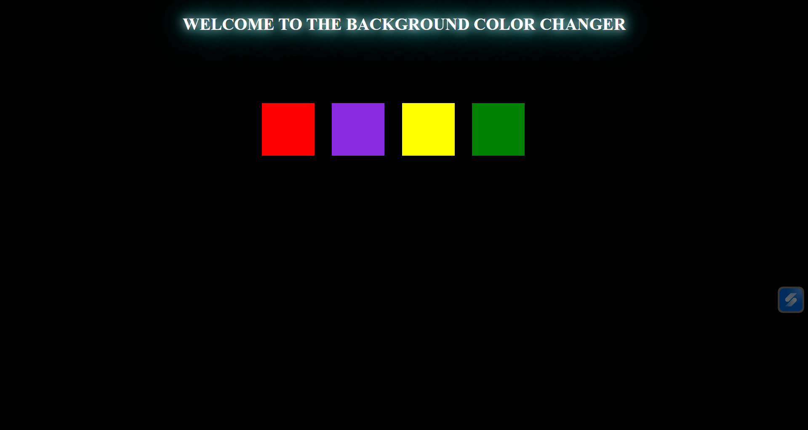

# 🎨 Background Color Changer

> A sleek, interactive web app that lets users instantly change the page background by clicking color swatches — built with pure HTML, CSS, and JavaScript.

## 🚀 Features

- **One-click color switching** — Click any color swatch to instantly change the background
- **4 vibrant presets** — Red, Purple, Yellow, and Green
- **Glowing title effect** — Eye-catching cyan neon text on a dark canvas
- **Lightweight & fast** — Zero dependencies, pure vanilla JS
- **Responsive layout** — Works across screen sizes

---

## 🛠️ Tech Stack

| Technology | Purpose            |
|------------|--------------------|
| HTML5      | Page structure     |
| CSS3       | Styling & layout   |
| JavaScript | Color change logic |

---

## preview



## 🌐 Live Demo

Check out the deployed version here:

👉 [Live Project](https://background-color-changer-lake.vercel.app/)

## 📁 Project Structure

```
background-color-changer/
│
├── index.html       # Main HTML file
├── style.css        # Styles for layout and swatches
├── script.js        # Click event logic
└── README.md        # Project documentation
```

---

## ⚙️ How It Works

1. The page loads with a **black background** by default.
2. Four color swatches are displayed in the center.
3. When a user **clicks a swatch**, a JavaScript event listener reads its color value and applies it to `document.body.style.backgroundColor`.

```js
// Example logic
const swatches = document.querySelectorAll('.swatch');

swatches.forEach(swatch => {
  swatch.addEventListener('click', () => {
    document.body.style.backgroundColor = swatch.dataset.color;
  });
});
```

---

## 🧑‍💻 Getting Started

### Prerequisites

All you need is a modern web browser — no installs required.

### Run Locally

```bash
# Clone the repository
git clone https://github.com/your-username/background-color-changer.git

# Navigate into the project folder
cd background-color-changer

# Open in browser
open index.html
# or just double-click index.html
```

---

## 🎨 Color Palette

| Swatch   | Color Name | Hex Code  |
|----------|------------|-----------|
| 🔴 Red    | Pure Red   | `#FF0000` |
| 🟣 Purple | Medium Purple | `#7B2FBE` |
| 🟡 Yellow | Bright Yellow | `#FFFF00` |
| 🟢 Green  | Forest Green | `#008000` |

---

## 💡 Possible Improvements

- [ ] Add a **custom color picker** input
- [ ] Show the **hex code** of the selected color
- [ ] Add **smooth transition** animation between background changes
- [ ] Include a **"Random Color"** button
- [ ] Save the last selected color to **localStorage**
- [ ] Add more color swatches or a full palette grid

---

## 🤝 Contributing

Contributions are welcome! Here's how:

1. Fork the project
2. Create your feature branch: `git checkout -b feature/add-color-picker`
3. Commit your changes: `git commit -m 'Add color picker input'`
4. Push to the branch: `git push origin feature/add-color-picker`
5. Open a Pull Request

---

## 📄 License

This project is open source and available under the [MIT License](LICENSE).

---

## 👨‍💻 Author

**Your Name**
- GitHub: [@Rohit12412021](https://github.com/Rohit12412021)
 

> ⭐ If you found this project helpful or fun, give it a star on GitHub!